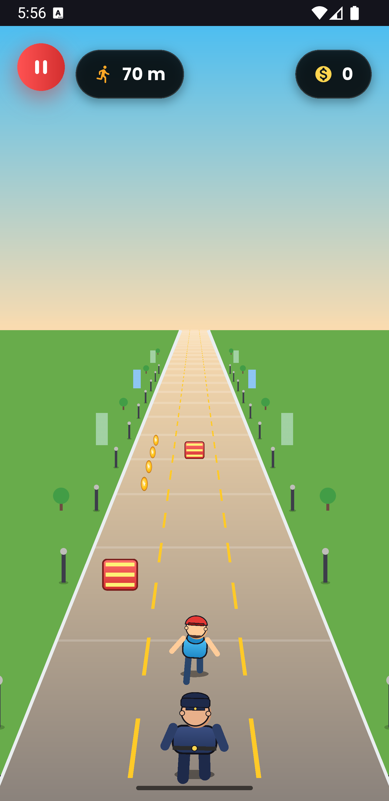

# Minimal Runner

A Flutter + Flame endless runner: dash between three lanes, dodge obstacles, collect coins,
and outrun the policeman chasing you. Built with a pseudo-3D ("Mode 7"-style) perspective
camera, a day/night cycle, and difficulty that ramps up the further you run.

## Gameplay

- **Swipe left/right** (or arrow keys) to change lanes, **swipe up** (or up arrow) to jump.
- Obstacles approach from the horizon and get faster and more frequent as your distance grows.
- Collect coins along the way; the HUD tracks distance and coins collected.
- Getting hit ends the run and lets the chaser catch up to you.
- The sky cycles between day and night over a fixed distance interval and back again.

## Project structure

```
lib/
  main.dart                        # App entry point
  screens/
    game_screen.dart               # HUD, pause/game-over overlays, input handling
  game/
    runner_game.dart               # FlameGame: shared perspective camera, speed ramp,
                                    # day/night cycle, game state
    game_state.dart                # Game state enum (menu/running/paused/gameOver)
    components/
      road.dart                    # Road surface, lane markings, scenery, day/night colors
      player.dart                  # Player runner (back view), animation, collision handling
      chaser.dart                  # Policeman chasing the player, catch-up behavior
      obstacle.dart                # Obstacles that travel toward the camera
      coin.dart                    # Collectible coins
    systems/
      obstacle_manager.dart        # Spawns obstacles, interval shrinks as speed increases
      coin_manager.dart            # Spawns coin trails
      score_manager.dart           # Best-distance persistence
      audio_manager.dart           # Sound effects / music
```

All world objects (road, player, chaser, obstacles, coins) share a single depth value `z` and
a common projection (`scaleForZ`, `screenYForZ`, `screenXForLane`) defined in `runner_game.dart`,
so anything at the same `z` lines up consistently on screen.

## Running the app

```bash
flutter pub get
flutter run
```

To build for web or a specific platform:

```bash
flutter build web --release
flutter build apk --release
```

## Requirements

- Flutter SDK (Dart `^3.12.2`, per `pubspec.yaml`)
- Dependencies: `flame`, `flame_audio`, `google_fonts`, `shared_preferences` (see `pubspec.yaml`)


## App Screenshot
